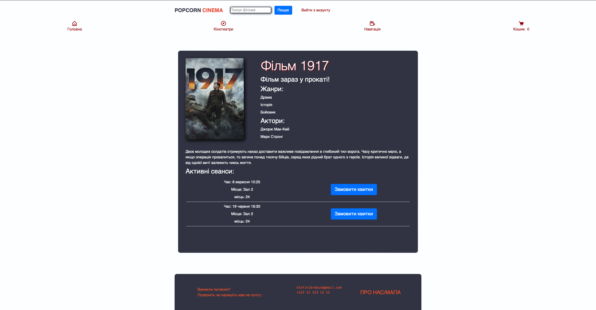
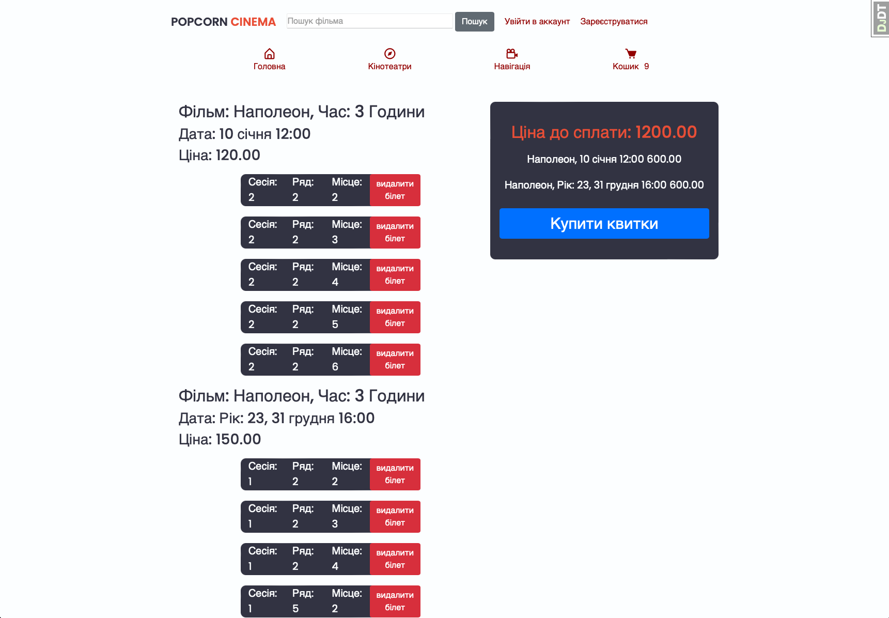
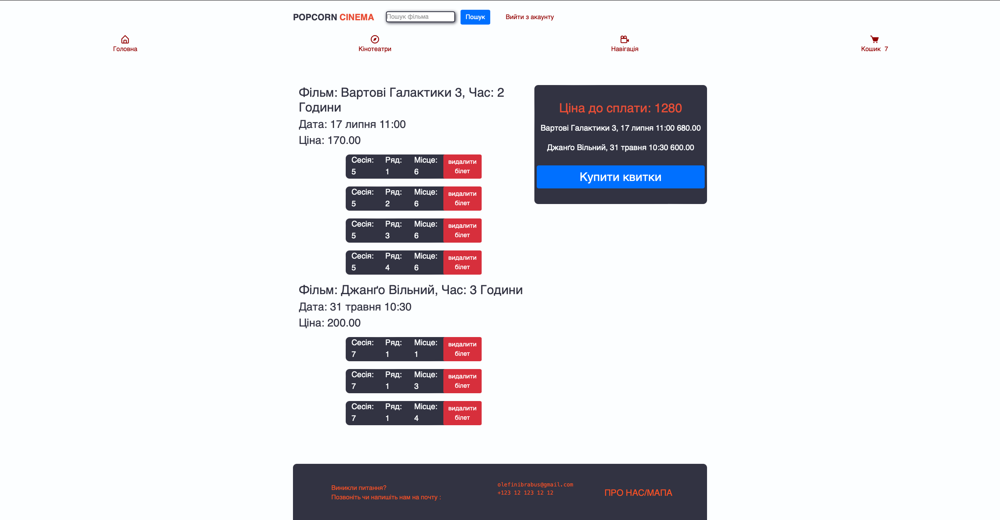
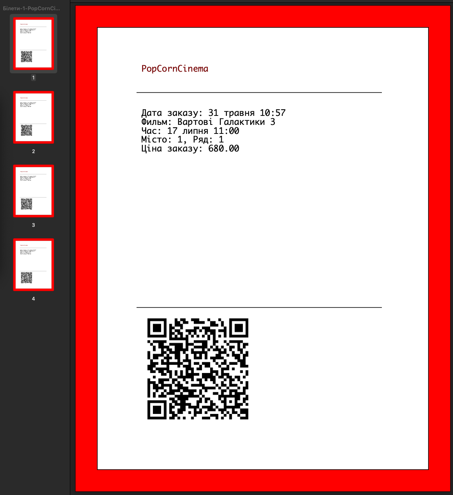

# PopCornCinema
## http://popcorncinema.website/

## Про додаток
Сервіс кінотеатру для бронювання, перегляду актуальних новинок у кіно
за допомогою Django фреймворку 

## Особливості
- Адмін панель
- Кошик через сессію користувача без аутентифікації
- створення заказу
- завантаження квитків у pdf файл зі штрихкодом

## Технології
- Python 3.9 
- Django 4.2.8
- Bootstrap 
- Jquery
- AJAX
- POSTGRESQL
- Amazon Ec2

## Головна сторінка

## Каталог фільмів

## Фільм

## Вибір квитків

## Кошик

## Pdf Файл квитків



## Встановлення додатку через Github
```bash
git clone  https://github.com/olefinbrabus/PopCornCinema
cd PopCornCinema
python -m venv venv
pip install -r requirements.txt
```

## Налаштування ключей середовища:
- Перейменуйте ім'я Файлу Sample.env на .env
- Впишіть значення які вам потрібні в ключах

## Запуск додатку через локальний сервер
```bash
python manage.py runserver 127.0.0.1:8000
```

## Запуск додатку через Docker
```bash
docker-compose build
docker-compose up
```
