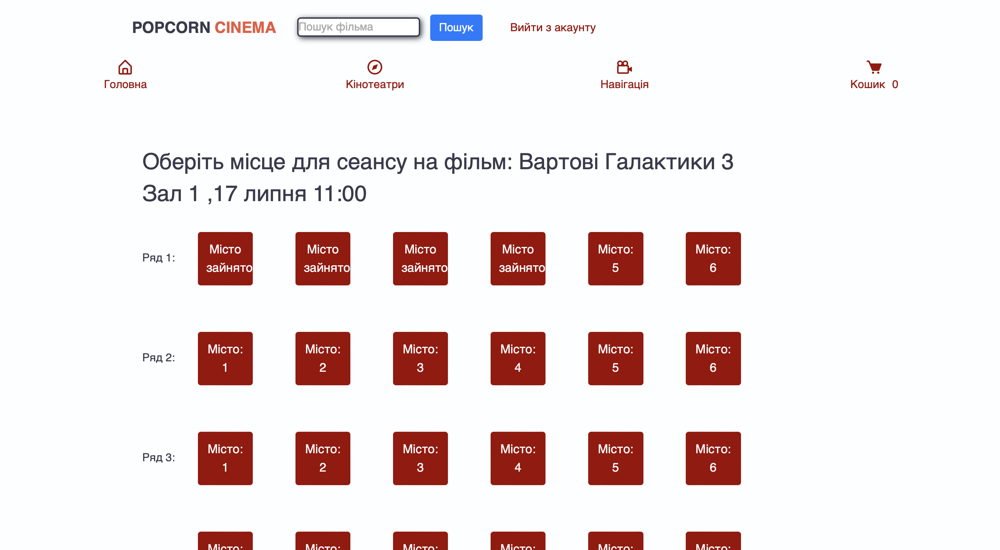

# PopCornCinema

## Про додаток
Сервіс кінотеатру для бронювання, перегляду актуальних новинок у кіно
за допомогою Django фреймворку 

## Особливості
- Адмін панель
- Кошик через сессію без аутентифікації

## У процесі
- створення заказу
- завантаження квитків у pdf файл зі штрихкодом

## Технології
- Python 3.9 
- Django 4.2.8
- Bootstrap 
- Jquery
- AJAX
- SQLite3

## Головна сторінка

## Каталог фільмів

## Вибір квитків

## Кошик



## Встановлення додатку через Github
```bash
git clone  https://github.com/olefinbrabus/PopCornCinema
cd PopCornCinema
python -m venv venv
pip install -r requirements.txt
```
